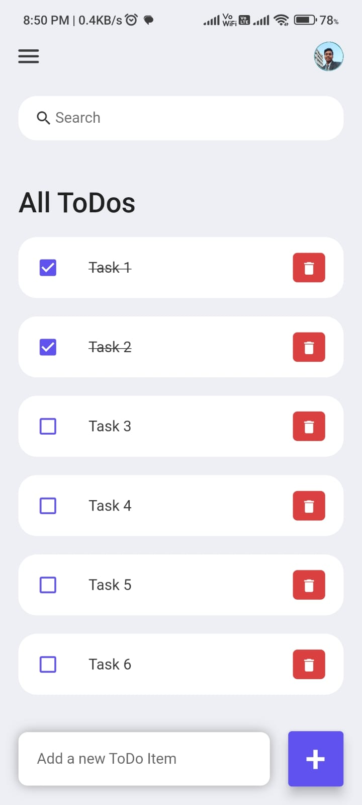

# FlutterToDo

---

<p align="center">
    
    
    <br />
    
    <h4 align="center"> Screenshot of the application </h4>
</p>
FlutterToDo is a versatile and user-friendly task management app built using the Flutter framework, compatible with both Android and iOS platforms.

---

## Features
- ✅ **Effortless Task Management**: Organize your tasks seamlessly with a simple and intuitive interface.
- ✅ **Cross-Platform**: Works flawlessly on Android and iOS devices.
- ✅ **Sleek Design**: A modern and elegant design that makes task management a breeze.
- ✅ **Productivity at Your Fingertips**: Stay productive on the go with FlutterToDo.

---

## Getting Started

1. **Clone the repository:**

   ```bash
        https://github.com/samriddha-basu-cloud/Flutter-todo-app-2.git
   ```

2. **Navigate to the project directory:**

   ```bash
        cd Flutter-todo-app-2
   ```

3. **Run the app:**

   ```bash
        flutter run
   ```
---

## Contributing

Contributions are welcome! Feel free to open issues or submit pull requests to help improve FlutterToDo.

---

Happy task management with FlutterToDo! 🚀
